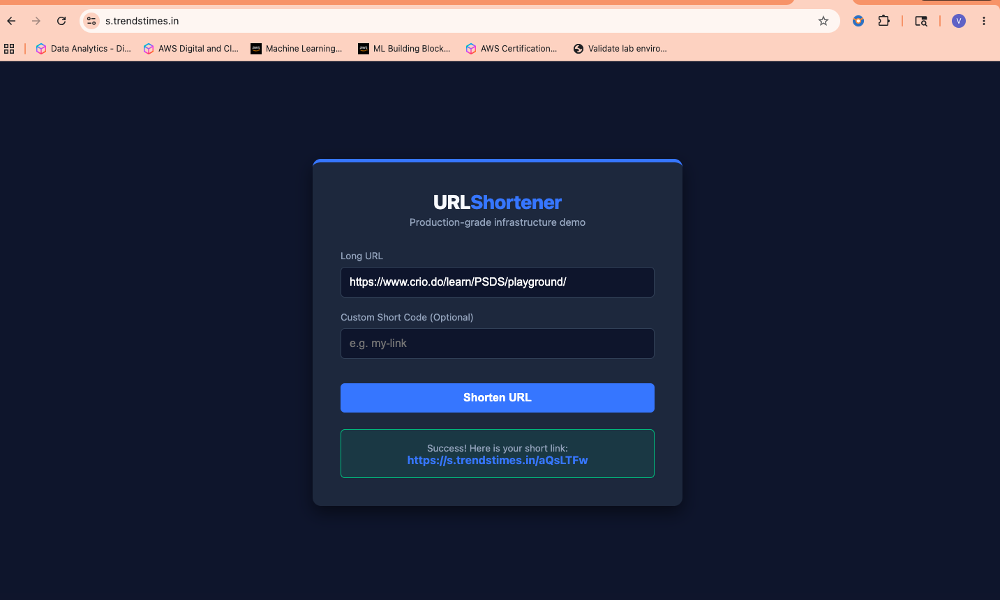
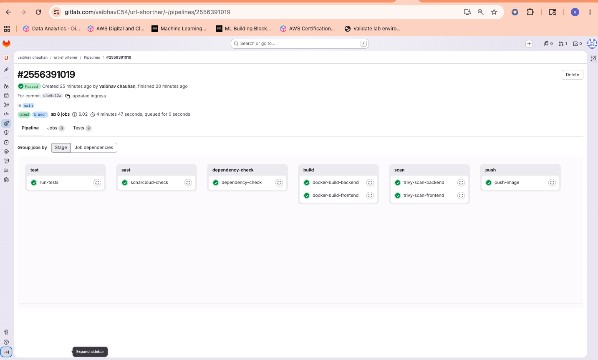
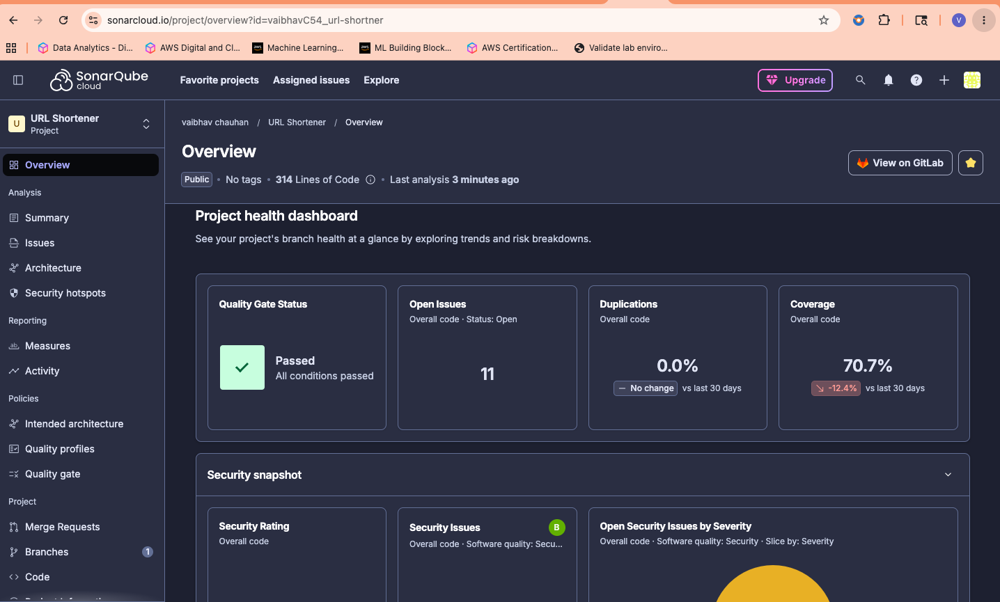
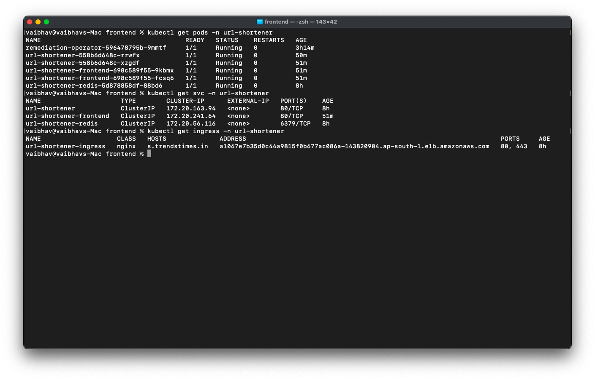

# 🚀 URL Shortener: Production-Grade DevSecOps Architecture

[](https://s.trendstimes.in)
[](https://fastapi.tiangolo.com/)
[](https://kubernetes.io/)
[](https://www.terraform.io/)
[](https://argoproj.github.io/cd/)
[](https://docs.gitlab.com/ee/ci/)

 
*Live application interface with custom short-code generation.*

## 📖 Project Overview
The URL Shortener is a production-grade DevSecOps project built entirely from scratch. It demonstrates the full software delivery lifecycle—from writing application code to deploying on AWS EKS with automated security scanning, GitOps continuous deployment, and automated incident remediation.

The application accepts `POST` requests to shorten URLs, serves `301` redirects, tracks visit counts via DynamoDB, and caches hot URLs in Redis for sub-millisecond redirects. 

**Key Achievement:** Every component was built from scratch—no tutorial forks. The full CI/CD pipeline blocks deployment on security failures, and the app runs on managed Kubernetes with automatic TLS, autoscaling, and self-healing.

---

## 🏗️ Architecture & Pipeline Flow

The project follows a strict left-to-right, security-first pipeline:

1. **Test:** `pytest` (9 unit tests with mocked AWS/Redis).
2. **SAST:** SonarCloud code quality gate.
3. **Dependency Scan:** `pip-audit` to catch Python package CVEs.
4. **Build:** Multi-stage Docker build to reduce attack surface.
5. **Image Scan:** Trivy container vulnerability scanning.
6. **Push:** Immutable SHA + `latest` tags pushed to DockerHub.
7. **GitOps:** ArgoCD detects the new tag and syncs to the EKS cluster.


*A zero-bypass GitLab CI/CD pipeline featuring parallel builds and strict Trivy/SonarCloud quality gates.*

---

## 🛠️ Technology Stack

| Layer | Technology | Purpose |
| :--- | :--- | :--- |
| **Application** | Python FastAPI | REST API — shorten, redirect, stats |
| **Database & Cache** | AWS DynamoDB, Redis 7 | Persistent URL storage, LRU hot cache |
| **Containerization** | Docker | Immutable, minimal, non-root image |
| **CI/CD & DevSecOps** | GitLab CI, SonarCloud, `pip-audit`, Trivy | Automated pipeline, SAST, CVE scanning |
| **Infrastructure (IaC)** | Terraform | AWS EKS, VPC, DynamoDB, IAM provisioning |
| **Orchestration & GitOps**| AWS EKS (K8s 1.31), Helm, ArgoCD | Managed K8s cluster, templated manifests, Git sync |
| **Security** | IRSA, cert-manager (Let's Encrypt) | Pod-level IAM, Automatic HTTPS |
| **Observability** | Prometheus, Grafana, Custom Python Operator | Metrics, alerting, automated crash remediation |

---

## 🔒 Security Summary (DevSecOps)

Security is baked into every layer of this architecture:
* **Code & Dependencies:** SonarCloud SAST and `pip-audit` block the pipeline on HIGH/CRITICAL vulnerabilities.
* **Container Security:** Trivy scans images, and the Dockerfile runs as an unprivileged, non-root user (`appuser`).
* **IAM Roles for Service Accounts (IRSA):** Pods assume AWS IAM roles directly via OIDC. **Zero AWS credentials are stored in the cluster or code.**
* **Network:** Automatic TLS via `cert-manager` and Let's Encrypt, with NGINX enforcing SSL redirects.


*Passing Quality Gate on SonarCloud validating 0 security vulnerabilities and clean maintainability.*

---

## ☸️ Kubernetes, GitOps, & Automated Remediation

The application is deployed to an AWS EKS cluster (`ap-south-1`). Infrastructure is provisioned via Terraform (with remote S3 state), and deployments are managed via Helm and ArgoCD.

### Custom Incident Remediation Operator
To demonstrate advanced Kubernetes administration, this cluster runs a custom **Python K8s Operator** that automatically detects and heals incidents every 30 seconds:
* **CrashLoopBackOff:** Deletes the pod to force a fresh restart and triggers a webhook alert.
* **High CPU:** Queries Prometheus (utilization > 80%) and scales the deployment replicas +1 (max 5).
* **OOMKilled:** Deletes the pod and issues a CRITICAL webhook memory warning.


*ArgoCD Application Details Tree mapping the Helm chart to live Kubernetes resources.*


*Terminal output proving 0 restarts, healthy decoupled pods, and active NGINX ingress routing.*

---

## 💻 Local Development Setup

To run the application on EKS-cluster:

```bash
# 1. Clone the repository
git clone [https://github.com/Vaibhav040/url-shortener.git](https://github.com/Vaibhav040/url-shortener.git)
cd url-shortener

# 2. Installation of EkS-Cluster through terraform
cd terraform/backend
  # Initialize the backend first for state locking
  1. terraform init
  2. terraform plan
  3. terraform apply

  # Initialize the Infrastructre
  cd terraform/infrastrucure
    vim variables.tf # ( Change the Domain name in variables to your Domain name)
    terraform init
    terraform plan
    terraform apply
# IMPORTANT: Destroy when done to stop billing
  terraform destroy

# 3. Connect to Kubectl and verify Nodes

aws eks update-kubeconfig --region ap-south-1 --name url-shortener-eks
kubectl get nodes

# 4 Install NGINX Controller on Cluster
helm repo add ingress-nginx https://kubernetes.github.io/ingress-nginx
helm repo update

helm install ingress-nginx ingress-nginx/ingress-nginx \
  --namespace ingress-nginx \
  --create-namespace \
  --set controller.service.type=LoadBalancer

# 5. Now point your domain to this load balancer. Go to your domain registrar.
Type:  CNAME
Name:  s
Value: a546d6fcacaeb40f3ab6308e71db02f5-2100767274.ap-south-1.elb.amazonaws.com
TTL:   300

# 6. ArgoCD setup for Application deployment
kubectl create namespace argocd

kubectl apply -n argocd -f https://raw.githubusercontent.com/argoproj/argo-cd/stable/manifests/install.yaml

  # check if pods are running
  kubectl get pods -n argocd
  # Get Password for Login
  kubectl -n argocd get secret argocd-initial-admin-secret \
  -o jsonpath="{.data.password}" | base64 -d

  # then do port forwarding from new terminal
  kubectl port-forward svc/argocd-server -n argocd 8080:443

# 7. Create new 2 apps in ArgoCD UI
  # 1. Application deployment
  1. Open https://localhost:8080
  2. Click + New App
  Fill in:
    Application Name: url-shortener
    Project: default
    Sync Policy: Automatic + check Prune and Self Heal
    Repository URL: your GitLab URL
    Path: helm/url-shortener
    Cluster: https://kubernetes.default.svc
    Namespace: url-shortener

    Click Create
  # 2 Remediation
  2. Click + New App
  Fill in:
    Application Name: operaters
    Project: default
    Sync Policy: Automatic + check Prune and Self Heal
    Repository URL: your GitLab URL
    Path: k8s/manifests/operaters
    Cluster: https://kubernetes.default.svc
    Namespace: url-shortener

    Click Create

# 8. Trigerr pipeline to do the deployment
can be done through UI or by commiting a simple changes to repo

# 9. Now install Cert-manager
helm repo add jetstack https://charts.jetstack.io
helm repo update

helm install cert-manager jetstack/cert-manager \
  --namespace cert-manager \
  --region ap-south-1 \
  --create-namespace \
  --set crds.enabled=true

# 10. Now create a ClusterIssuer that tells cert-manager to use Let's Encrypt to issue certificates:

kubectl apply -f k8s/manifests/cluster-issuer.yaml # As it's one time process

# 11. Set Up IRSA for DynamoDB Access
# Create IAM policy for DynamoDB
1. aws iam create-policy \
  --policy-name url-shortener-dynamodb-policy \
  --policy-document '{
    "Version": "2012-10-17",
    "Statement": [
      {
        "Effect": "Allow",
        "Action": [
          "dynamodb:GetItem",
          "dynamodb:PutItem",
          "dynamodb:UpdateItem",
          "dynamodb:DeleteItem",
          "dynamodb:Query",
          "dynamodb:Scan"
        ],
        "Resource": "arn:aws:dynamodb:ap-south-1:<YOUR_AWS_ACCOUNT_ID>:table/url-shortener"
      }
    ]
  }'
  # Copy the ARN number will be required later
# Get your OIDC provider ID first
2. aws eks describe-cluster \
  --name url-shortener-eks \
  --query "cluster.identity.oidc.issuer" \
  --output text

# Create IAM role for the service account
3. aws iam create-role \
  --role-name url-shortener-sa-role \
  --assume-role-policy-document '{
    "Version": "2012-10-17",
    "Statement": [
      {
        "Effect": "Allow",
        "Principal": {
          "Federated": "arn:aws:iam::<YOUR_AWS_ACCOUNT_ID>:oidc-provider/oidc.eks.ap-south-1.amazonaws.com/id/<YOUR_OIDC_ID>"
        },
        "Action": "sts:AssumeRoleWithWebIdentity",
        "Condition": {
          "StringEquals": {
            "oidc.eks.ap-south-1.amazonaws.com/id/<YOUR_OIDC_ID>:sub": "system:serviceaccount:url-shortener:url-shortener-sa",
            "oidc.eks.ap-south-1.amazonaws.com/id/<YOUR_OIDC_ID>:aud": "sts.amazonaws.com"
          }
        }
      }
    ]
  }'
# Attach policy to role
4. aws iam attach-role-policy \
--role-name url-shortener-sa-role \
--policy-arn <PASTE_COPIED_ARN_FROM STEP-1>

# Annotate the service account with the role ARN
Update values.yaml: in helm

serviceAccount:
  create: true
  name: url-shortener-sa
  annotations:
    eks.amazonaws.com/role-arn: arn:aws:iam::<YOUR_ACCOUNT_ID>:role/url-shortener-sa-role

# ( COMMIT RHE CHANGES TO REFRESH THE PODS)

# 12. Test the Health Endpoint
curl http://localhost:8000/health

# 4. Shorten a URL
